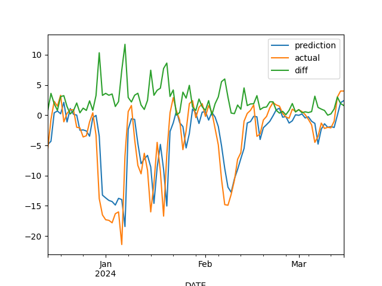

# Temperature prediction

This repo is based on "Temperature prediction" exercise by Dataquest (https://github.com/dataquestio).
The original code is [here](https://github.com/dataquestio/project-walkthroughs/tree/master/temperature_prediction).

## Observation data

I downloaded the data from FMI (Finnish Meteorological Institue) for Espoo city from [here](https://en.ilmatieteenlaitos.fi/download-observations)

* Weather observations --> Daily observations --> Select all

## Result
